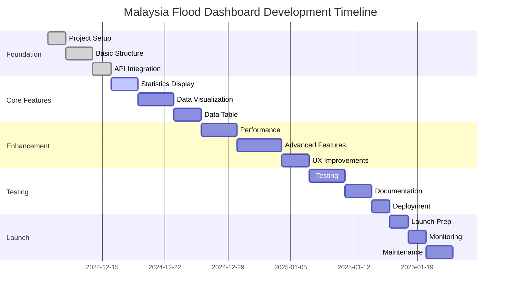

# Malaysia Flood Information Dashboard: Development Plan 📋

## Phase 1: Foundation (Week 1) 🏗️

### 1.1 Project Setup
- [x] Initialize GitHub repository
- [x] Set up GitHub Pages
- [x] Create basic project structure
- [x] Configure development environment

### 1.2 Basic Dashboard Structure
- [x] Create HTML template
- [x] Implement responsive CSS layout
- [x] Set up D3.js integration
- [x] Create basic JavaScript structure

### 1.3 API Integration
- [x] Implement API connection
- [x] Set up data fetching mechanism
- [x] Create data processing utilities
- [x] Implement error handling

## Phase 2: Core Features (Week 2) 🎯

### 2.1 Statistics Display
```javascript
// Implementation Structure
function updateStatistics(data) {
    const stats = {
        totalPPS: data.length,
        totalVictims: calculateTotalVictims(data),
        totalFamilies: calculateTotalFamilies(data)
    };
    updateDashboardCards(stats);
}
```

#### Tasks
- [x] Create statistics cards
- [x] Implement data calculations
- [x] Add animations
- [x] Implement auto-refresh

### 2.2 Data Visualization
```javascript
// D3.js Chart Structure
function createBarChart(data) {
    // Set up dimensions
    // Process data
    // Create scales
    // Draw axes
    // Create bars
    // Add interactions
}
```

#### Tasks
- [x] Design bar chart layout
- [x] Implement D3.js visualization
- [x] Add interactive features
- [x] Create responsive design

### 2.3 Data Table
```javascript
// Table Implementation
function createDataTable(data) {
    // Sort data
    // Create table structure
    // Populate cells
    // Add sorting functionality
}
```

#### Tasks
- [x] Create table structure
- [x] Implement sorting
- [x] Add search functionality
- [x] Style table elements

## Phase 3: Enhancement (Week 3) 🚀

### 3.1 Performance Optimization
```javascript
// Performance Improvements
const optimizations = {
    lazyLoading: true,
    dataCache: true,
    debounceUpdates: true,
    compressAssets: true
};
```

#### Tasks
- [ ] Implement lazy loading
- [ ] Add data caching
- [ ] Optimize asset delivery
- [ ] Implement debouncing

### 3.2 Advanced Features
```javascript
// Feature Implementation
const advancedFeatures = {
    filteringSystem: implementFilters(),
    exportData: setupExport(),
    analytics: setupAnalytics(),
    notifications: setupNotifications()
};
```

#### Tasks
- [ ] Add filtering system
- [ ] Implement data export
- [ ] Add analytics tracking
- [ ] Create notification system

### 3.3 User Experience Improvements
```css
/* UX Enhancements */
.dashboard {
    --loading-animation: fade-in 0.3s ease;
    --transition-speed: 0.2s;
    --hover-effect: scale(1.02);
}
```

#### Tasks
- [ ] Add loading animations
- [ ] Improve transitions
- [ ] Enhance hover effects
- [ ] Implement tooltips

## Phase 4: Testing & Documentation (Week 4) 🧪

### 4.1 Testing
```javascript
// Testing Framework
const tests = {
    unit: ['API', 'Data Processing', 'UI Components'],
    integration: ['End-to-End', 'Performance', 'Responsiveness'],
    accessibility: ['WCAG 2.1', 'Screen Readers', 'Keyboard Navigation']
};
```

#### Tasks
- [ ] Write unit tests
- [ ] Perform integration testing
- [ ] Conduct accessibility audit
- [ ] Run performance tests

### 4.2 Documentation
```markdown
# Documentation Structure
1. User Guide
2. API Documentation
3. Development Guide
4. Deployment Instructions
```

#### Tasks
- [ ] Create user documentation
- [ ] Write API documentation
- [ ] Document codebase
- [ ] Create deployment guide

### 4.3 Deployment
```bash
# Deployment Checklist
- Minify code
- Compress assets
- Update dependencies
- Configure CI/CD
```

#### Tasks
- [ ] Set up CI/CD pipeline
- [ ] Configure production environment
- [ ] Implement monitoring
- [ ] Create backup system

## Phase 5: Launch & Monitoring (Week 5) 🚀

### 5.1 Launch Preparation
```javascript
// Launch Checklist
const launchChecklist = {
    security: performSecurityAudit(),
    performance: runPerformanceTests(),
    compatibility: checkBrowserSupport(),
    accessibility: validateAccessibility()
};
```

#### Tasks
- [ ] Security audit
- [ ] Performance testing
- [ ] Browser testing
- [ ] Final QA review

### 5.2 Monitoring Setup
```javascript
// Monitoring System
const monitoring = {
    uptime: setupUptimeMonitoring(),
    errors: implementErrorTracking(),
    analytics: setupUsageAnalytics(),
    performance: trackPerformanceMetrics()
};
```

#### Tasks
- [ ] Set up monitoring tools
- [ ] Configure alerts
- [ ] Implement logging
- [ ] Create dashboards

### 5.3 Maintenance Plan
```javascript
// Maintenance Schedule
const maintenance = {
    daily: ['Data validation', 'Error checking'],
    weekly: ['Performance review', 'Update dependencies'],
    monthly: ['Security patches', 'Feature updates'],
    quarterly: ['Major updates', 'Infrastructure review']
};
```

#### Tasks
- [ ] Create maintenance schedule
- [ ] Set up automated tasks
- [ ] Document procedures
- [ ] Assign responsibilities

## Timeline Overview 📅



## Resource Allocation 📊

### Development Team
- 1 Frontend Developer (Full-time)
- 1 UI/UX Designer (Part-time)
- 1 QA Engineer (Part-time)

### Tools & Technologies
- Version Control: Git/GitHub
- Development: VS Code
- Testing: Jest
- CI/CD: GitHub Actions
- Monitoring: Google Analytics

## Risk Management 🛡️

### Identified Risks
1. **API Reliability**
   - Mitigation: Implement caching
   - Fallback: Local data storage
   - Monitor: API uptime

2. **Performance Issues**
   - Mitigation: Optimization techniques
   - Fallback: Reduced feature set
   - Monitor: Loading times

3. **Browser Compatibility**
   - Mitigation: Progressive enhancement
   - Fallback: Basic functionality
   - Monitor: Usage statistics

## Success Criteria 🎯

### Technical Metrics
- Page load time < 3s
- API response time < 1s
- 99.9% uptime
- Zero critical bugs

### User Metrics
- 90% user satisfaction
- < 1% error rate
- > 50% return users
- < 2s average response time

## Conclusion 📝

This development plan outlines a structured approach to building the Malaysia Flood Information Dashboard. The plan is designed to be agile and adaptable, with clear milestones and deliverables. Regular reviews and updates will ensure the project stays on track and meets its objectives.
